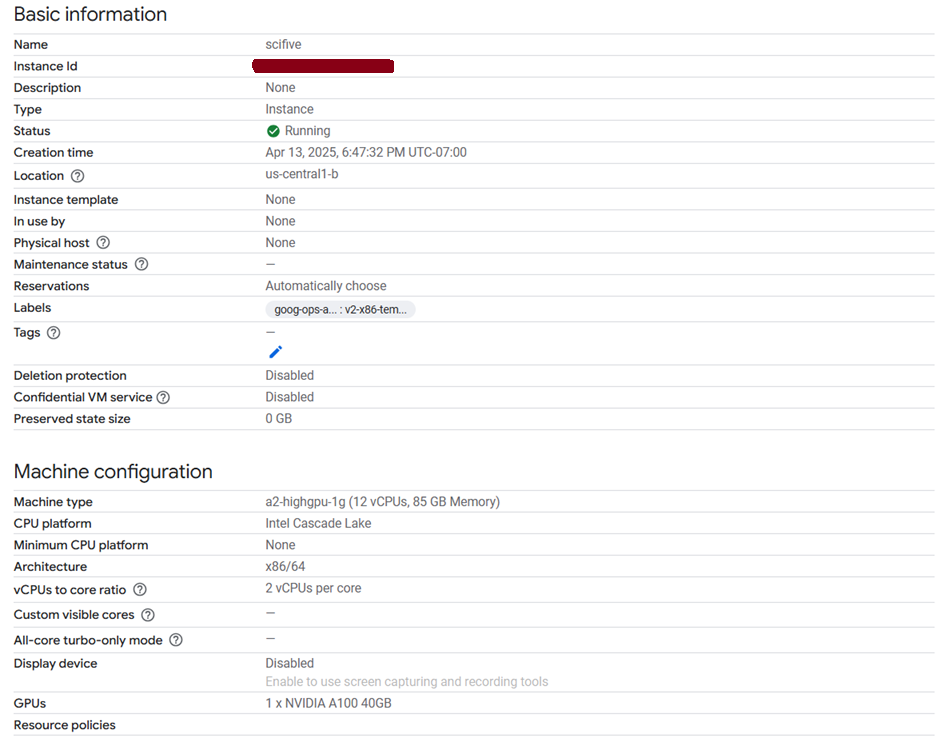
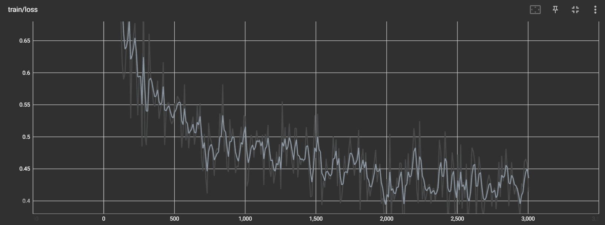

# Medical-Assistant

A medical question-answering system utilizing the provided [dataset](https://drive.google.com/file/d/1upzfj8bXP012zZsq01jcoeO9NyhmTHnQ/view?usp=drive_link) containing medical information. The goal is to create a model that can effectively answer user queries related to medical diseases. You are free to augment the provided dataset with other medical datasets if you feel it is necessary.

## Tasks 

### Data Preprocessing:

Ensure the data is structured appropriately for model training, validation, and testing.

### Model Training:

Develop a machine learning model using natural language processing (NLP) techniques to understand and respond to user queries. Choose an appropriate architecture for the model, considering factors such as the complexity of the dataset and the computational resources available.

### Model Evaluation:

Evaluate the model's performance using appropriate metrics. State your reasoning for using the metric.

### Example Interaction:

Include at least three example interactions where the user asks a question (something similar to the provided dataset), and the model provides an answer.

### Documentation:

Provide a README file with a concise description of the approach used to tackle the problem. Include:
- Details about any assumptions made during model development and training. 
- Model's performance, highlighting its strengths and weaknesses. 
- Potential improvements or extensions to the solution, such as refining the model architecture, etc.


## Explanation to the solution

### Key Findings 

*I logged my reasoning process in `trial/trial.ipynb`.* 

1. Data Inspect Result 
   
   - Questions focus on definitions (e.g. What is (are) ..., ), symptoms (e.g. What are the symptoms of ...), prevention (How to prevent ...) and treatments (What are the treatments for ...) of diseases such as Glaucoma, High Blood Pressure, Tuberculosis, Cyclic Vomiting Syndrome, ... .
  - There are several pairs containing the same question.
  - The dataset looks like scraping result. 

2. Dataset Source 
   
   - Pretty similar to medQuad(`data/MedQuad_QA.csv`) 
   - Need cleaning. I downloaded cleaned version(`data/clean_data.csv`). 
   - *assumed this cleaned version will be better for fine-tuning*

3. Model Selection 
   
   - I chose SciFive as a foundation model. 
   - Why? 
    * SciFive is based on T5 architecture and pre-trained on extensive medical literature(PubMed, PMC), ensuring it understands medical terminology and concepts.
    * This is a strong choice for question-answering. 
    * Model parameters are 770M which could be a good fit for my GPU RAM size(48GB).

4. Dataset Sanitization 
   
   - Remove pairs exceeding `max_token_length` of SciFive. 
   - Remaining: 13,999 pairs, 4,737,589 tokens in total
   - Here is [result](./data/sanitized_data.csv).

5. Evaluation 

   As long as this is a generative QA, metrics should show the model's ability to capture the semantics while answering the questions. 
   To make it the best, I think we need to hire human evaluators (they would be domain experts) to check the model's output and rank in an efficient way. 
   But I don't feel it necessary in this case. 
   It looks like [Semantic Answer Similarity (SAS)](https://arxiv.org/abs/2108.06130) is also a very good option. 
   SAS directly calculates semantic similarity by calculating embedding. Although this project belongs to healthcare domain and requires exact semantic capturing, this method requires additional computational resources so we will not choose this metrics. 
   Maybe we could use other systematic metrics to capture the semantics such as BERT, ROUGE, METEOR, etc. Not EM or F1. 
   These often correlate poorly with human judgement, especially in medical contexts where precision is critical

   ```python
   # Metrics 
   f1_metric = load_metric("f1", trust_remote_code=True)
   bleu_metric = load_metric("bleu", trust_remote_code=True)
   rouge_metric = load_metric("rouge", trust_remote_code=True)

   def compute_metrics(eval_pred):
      predictions, labels = eval_pred 
      
      # Decode predictions and labels
      decoded_preds = tokenizer.batch_decode(predictions, skip_special_tokens=True) 
      
      labels = np.where(labels != -100, labels, tokenizer.pad_token_id) 
      decoded_labels = tokenizer.batch_decode(labels, skip_special_tokens=True) 
      
      # Normalize predictions and labels for EM (strip whitespace)
      decoded_preds = [pred.strip() for pred in decoded_preds]
      decoded_labels = [label.strip() for label in decoded_labels]
      
      # Exact Match (EM)
      em_scores = [1 if pred == ref else 0 for pred, ref in zip(decoded_preds, decoded_labels)]
      em_result = {"exact_match": np.mean(em_scores)}
      
      # BLEU 
      bleu_preds = [pred.split() for pred in decoded_preds]
      bleu_refs = [[ref.split()] for ref in decoded_labels]
      bleu_result = bleu_metric.compute(predictions=bleu_preds, references=bleu_refs)
      
      # F1 
      f1_preds = [set(pred.split()) for pred in decoded_preds]
      f1_refs = [set(ref.split()) for ref in decoded_labels]
      f1_scores = []
      for pred, ref in zip(f1_preds, f1_refs):
         true_positives = len(pred & ref)
         precision = true_positives / len(pred) if pred else 0
         recall = true_positives / len(ref) if ref else 0
         f1 = 2 * (precision * recall) / (precision + recall) if (precision + recall) else 0
         f1_scores.append(f1)
      f1_result = {"f1": np.mean(f1_scores)}
      
      # ROUGE 
      rouge_result = rouge_metric.compute(predictions=decoded_preds, references=decoded_labels)
      
      return {
         "exact_match": em_result["exact_match"],
         "bleu": bleu_result["bleu"],
         "f1": f1_result["f1"],
         "rouge1": rouge_result["rouge1"].mid.fmeasure,
         "rouge2": rouge_result["rouge2"].mid.fmeasure,
         "rougeL": rouge_result["rougeL"].mid.fmeasure
      }
   ```


### Training Config 

1. Hyperparameters 

   ```python
   training_args = TrainingArguments(
      output_dir=results_path,
      num_train_epochs=5,
      per_device_train_batch_size=2,
      per_device_eval_batch_size=1,
      gradient_accumulation_steps=8,
      eval_accumulation_steps=50,
      warmup_steps=10,
      weight_decay=0.01,
      logging_dir=logs_path,
      logging_steps=10, 
      evaluation_strategy="steps",
      eval_steps=100,
      save_strategy="steps",
      save_steps=100, 
      metric_for_best_model="eval_loss",
      greater_is_better=False,
      save_total_limit=30,
   )
   ```

2. Explanation 
   
   - Model and Dataset Compatibility 

     As long as this is against some laws that shows the relationship between dataset and model param size such as Chinchilla. But this is only fine-tuning process and original SciFive model was already trained on big dataset. 
     So I assumed 4.7M QA dataset is enough for fine-tuning 774M model. 

   - GPU memory usage during training 
  
      | Component | Memory(GB) | Notes |
      |:--: | :--: | :--: |
      | Model Parameters | 3 | ~700M parameters. 4 bytes each |
      | Gradients | 3 | Same size as parameters, stored during backpropagation |
      | Optimizer States | 6 | Adam with two states per parameter |
      | Activations | 8 | Batch size 2, sequence length 1024, depends on T5 architecture. |
      | Overhead | 4 | Framework, CUDA, temporary buffers. |
      | Evaluation | 4 | Activation required for evaluation |
      | Total | 28 | |

      I think this is optimzal for current GPU capacity. 

   - VM Config 
  
     

   - Train Loss 
     
     

### Sample Interactions 

**Input**: what are marine toxins?

**Original Output (before fine-tuning)**: *toxins*

**Output**: Marine toxins have multiple effects and may lead to different illnesses. They are toxins in marine fish and seafood. They have a variety of actions, from preventing the use of certain foods to preventing illnesses. These can include exposure to certain chemicals in seafood, such as benzene, acetaminophen, sulfadiazine, and toxin A. The major mechanism of action of marine toxins is unclear. However, the mechanisms by which they produce these harmful toxins differ between species. Their main purpose is to protect organisms from harmful levels. The health risks associated with exposure to marine toxicity can be prevented by consuming the essential oil. In fact, many parts of the food are not used for humans.

**Input**: What is (are) Yellow Fever Vaccination ?

**Original Output (before fine-tuning)**: *What are*

**Current Output**: Yellow fever is a viral infection of the human immune system called YFV. Many people will not become infected until they've had a booster dose of vaccine, so they do not receive a boost dose. There are many ways to get Y FV vaccine. The main ways to protect yourself against yellow fever are through vaccination. Your child's vaccination schedule depends on your age and gender. The primary route of vaccination is through a health care provider, and you may receive booster doses when you have antibodies that are specific to that cause yellow fever. You should be at least six months after the booster. This includes an RDT, a short term for the second type of vaccine. If you are infed, you may develop yellow fever soon after receiving a relapse and get a severe illness called lymphocccancerous leuclear disease. Yellow fever causes high levels of antibodies in your body. A yellow fever vaccine is formulated by doctors who use the YCFD Network. The vaccine includes four types of yellow fever, two types of - Type 1 and type B, if you receive it from your physician. Vaccines, C, DTP, DPTs, and DPT.

**Input**: Who is at risk for Parasites - Lice - Body Lice? ?

**Original Output (before fine-tuning)**: *Patients with Neurological Disorders*

**Output**: It has been shown that exposure to body lice can lead to many health problems including: Intestinal worms, like a larva in a lice-infected insect, is one way to transmit the infection. Insecticide-resistant Lice usually cannot spread into humans; however, a bite or an infection by a contaminated wound or hair can increase the risk of a person having a body lice infestation. If a mosquito bites a human, it could make people more susceptible to infections by contaminating food such as hot water, or smoke and/or chemical compounds. Some of the eggs are not visible to the skin. This means that the larvae is not present in the skin on the body. If an animal dies from an irashes of body lice, you may have skin infections with a mild sting.

### Evaluation 

*Strength*:

- This model has great capability to understand medical concepts. 

*Weakness*: 

- It seems like this model was a little too optimized for the train dataset. There was a forgetting while fine-tuning.


## Important Stuff 

### Further Improvements 

1. First, we can leverage several fine-tuning methodlogies such as PEFT for fast fine-tuning as well as reserving the main capability of the model itself. 
2. I think it is a normal phenomenon that we can see after fine-tuning a model on a small dataset, Catastrophic Forgetting. We can add diverse content to fine-tuning dataset to tackle this. I added the link for other sources of medical content.
3. We can re-fine the dataset by employing human experts. Also it is possible to re-fine it using LLM pre-trained by massive dataset from Internet, which has a lot of potential and advantages. ([Foundations of Large Language Models](https://arxiv.org/abs/2501.09223))

### Share Link 

https://drive.google.com/file/d/1-7AZbG137zpMNmX0jJwkGTxtptJBwytG/view?usp=drive_link


### Project Structure 

**data**: 
- dataset file(`sanitized_dataset.csv`) 

**logs**: 
- log file containing train_loss 

**models**: 
- base model(`SciFive-large-Pubmed_PMC`)

**scripts**: 
- *SciFiveMed-package* (trained on VertexAI) 
- *train.py* (trained on GPU server, Google Cloud VM instance in my case)
- *evaluate.py* (evaluate model performance in 4 metrics - EM, F1, BLEU, ROUGE) 
- *inference.py* (predict using fine-tuned model)